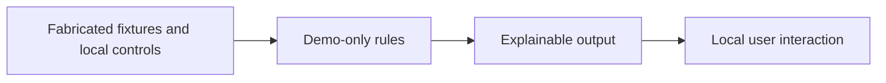

# Architecture

React + TypeScript + Vite render the interface. Small, independently written pure JavaScript functions implement the toy decisions in `src/logic.mjs`; Node tests exercise decision boundaries. Fixtures are visibly synthetic and live beside the demo.

This browser-only portfolio project intentionally omits an API, database, authentication, OCR/LLM service, migrations and production Docker Compose. Those services are not needed for a synthetic frontend demonstration. This is a documented exception to full operational application delivery conventions, not a production deployment template. No cloud credentials, analytics, external assets or runtime network calls are required.

Public code was authored independently from inspected high-level capabilities. No files or Git objects were imported from the private implementation. The public history starts with this demonstration.
